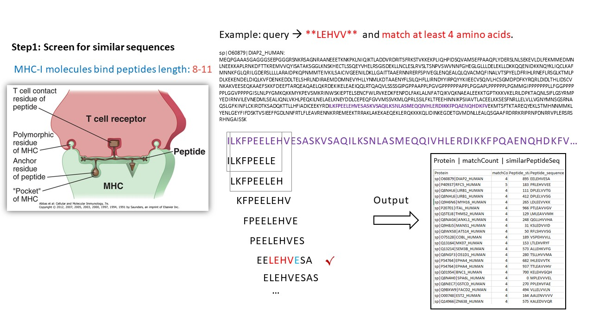

# peptideMap

## PeptideMap is a small tools of Peptide cross-reactivity screening 
 
 

Step1: Use the sliding windows to search for similar fragments on the whole protein sequence as candidate peptides <br/>
whole protein sequence download site: [UP000005640_9606.fasta](https://www.ebi.ac.uk/reference_proteomes/)

Step2: Use NetMHCpan-4.1 server to predict the binding of peptides to any MHC molecule

Step3: Screen for highly expressed proteins Based on the IHC and RNA expression data from The Human Protein Atlas <br/>
Normal tissue IHC data and RNA consensus tissue gene data download site: [The Human Protein Atlas Data](https://www.proteinatlas.org/about/download)

Step4: Final merge the Step2 and Step3

## Output:
 

## Getting Started
### preparation
conda create -n BIO python=3.8

conda activate BIO

conda install -c conda-forge biopython

install netMHCpan-4.1

cd ~/pipetideMap 

### RUN
Modify parameters in the "main.sh" <br/>
e.g. <br/>
```
#---------------------------------------------#
#  Required parameters                        #
#---------------------------------------------#
query="EVDPIXXXY"
atleast_matchAA=5
MHCallele="HLA-A01:01"
```
bash main.sh
